<p align="center">
  <a href="" rel="noopener">
  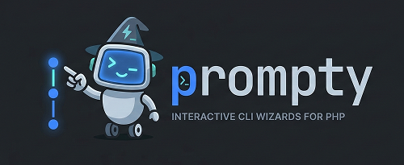</a>
</p>

<h1 align="center">Zero-dependency interactive CLI prompt library for PHP</h1>

<div align="center">

[](https://github.com/alexskrypnyk/prompty/issues)
[](https://github.com/alexskrypnyk/prompty/pulls)
[](https://github.com/alexskrypnyk/prompty/actions/workflows/test-php.yml)
[](https://codecov.io/gh/alexskrypnyk/prompty)


</div>

---

<p align="center">
  
</p>

## Features

- 📦 [**Zero dependencies**](#installation) — drop `Prompty.php` into your project or [embed](#embedding) into your script
- 🧩 [**Widgets**](#widgets) — `text`, `select`, `multiselect`, `confirm`
- 🔀 [**Flows**](#flows) — group prompts into a wizard with intro/outro, numbering, and cancellation
- 🌳 [**Nested flows**](#nested-flows-with-conditions) — conditional children rendered as a tree
- ⚡ [**Standalone mode**](#standalone-mode) — use any widget on its own, outside of a flow
- 🌍 [**Environment variable discovery**](#environment-variable-discovery) — auto-fill answers from env vars
- 💬 [**Descriptions and hints**](#descriptions-and-hints) — contextual help below labels and per-option
- ✨ [**Unicode and ASCII**](#unicode-and-ascii) — auto-detects terminal support or force a mode
- 🎨 [**ANSI colors**](#ansi-colors) — auto-detects color support, respects `NO_COLOR`
- ⚙️ [**Configuration**](#configuration) — symbols, colors, spacing, labels, env prefix, truthy/falsy values
- 🧪 [**Test harness**](#test-harness) — `PromptyTestTrait` injects keystrokes for PHPUnit testing
- 🚀 [**Starter script**](#starter-script) — [`starter.php`](starter.php) as a template for your own scripts
- 📥 [**Embedding**](#embedding) — minify and embed the class directly into your script

## Installation

Prompty is a single PHP file with zero dependencies.

### Download from releases

Download `Prompty.php` from the
[latest release](https://github.com/AlexSkrypnyk/prompty/releases/latest)
assets.

Three variants are available:

| Asset                 | Description                                        |
|-----------------------|----------------------------------------------------|
| `Prompty.php`         | Full source with version imprinted                 |
| `Prompty.min.php`     | Minified — comments and blank lines stripped       |
| `Prompty.compact.php` | Compacted — single-line class, shortened internals |

For testing, also download `PromptyTestTrait.php` from the same release.

See [Usage](#usage) for how to embed the class directly into your script.

### Composer

```bash
composer require alexskrypnyk/prompty
```

`PromptyTestTrait` is included in the package.

## Usage

Require the file and use the class directly:

```php
require_once __DIR__ . '/Prompty.php';

use AlexSkrypnyk\Prompty\Prompty;

$name = Prompty::text('Project name');
```

Or [embed](#embedding) the minified class directly into your script (using
provided minification script) to ship a single file with no external dependencies.

You may also use the [starter](#starter-script) as a template for your own scripts.

## Widgets

Four widget types cover the most common prompt patterns. Each returns the user's
answer, or `null` if they cancel (Escape or Ctrl+C).

### Text

Free-form text input with an optional placeholder.

```php
$name = Prompty::text('Project name',
  placeholder: 'my-app',
  description: "Used as the directory name\nand the package name.",
);
```

<table>
  <tr>
    <td></td>
    <td align="center"><strong>ANSI</strong></td>
    <td align="center"><strong>No ANSI</strong></td>
  </tr>
  <tr>
    <td align="right"><strong>Unicode</strong></td>
    <td>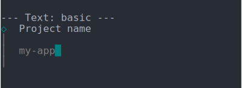</td>
    <td>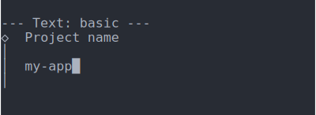</td>
  </tr>
  <tr>
    <td align="right"><strong>ASCII</strong></td>
    <td>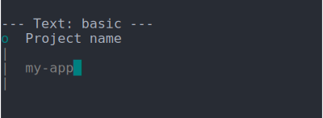</td>
    <td></td>
  </tr>
</table>

### Select

Single-choice from a list. Arrow keys to navigate, Enter to confirm.

```php
$framework = Prompty::select('Framework',
  options: ['react' => 'React', 'vue' => 'Vue', 'svelte' => 'Svelte'],
  description: 'The UI layer for your project.',
  hints: [
    'react' => 'Component-based library by Meta.',
    'vue' => "Gentle learning curve.\nSingle-file components.",
    'svelte' => 'Compile-time framework — no virtual DOM.',
  ],
);
```

<table>
  <tr>
    <td></td>
    <td align="center"><strong>ANSI</strong></td>
    <td align="center"><strong>No ANSI</strong></td>
  </tr>
  <tr>
    <td align="right"><strong>Unicode</strong></td>
    <td>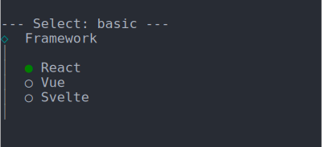</td>
    <td>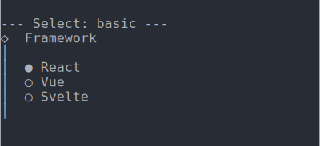</td>
  </tr>
  <tr>
    <td align="right"><strong>ASCII</strong></td>
    <td>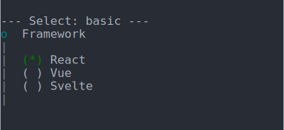</td>
    <td>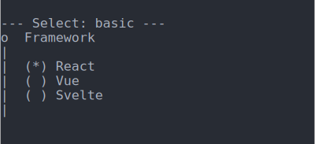</td>
  </tr>
</table>

### Multiselect

Multiple-choice from a list. Space to toggle, Enter to confirm.

```php
$features = Prompty::multiselect('Features',
  options: ['ts' => 'TypeScript', 'eslint' => 'ESLint', 'prettier' => 'Prettier'],
  description: "Space to toggle, enter to confirm.",
);
```

<table>
  <tr>
    <td></td>
    <td align="center"><strong>ANSI</strong></td>
    <td align="center"><strong>No ANSI</strong></td>
  </tr>
  <tr>
    <td align="right"><strong>Unicode</strong></td>
    <td>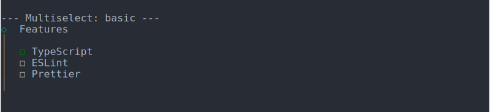</td>
    <td>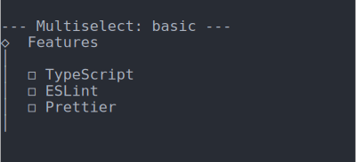</td>
  </tr>
  <tr>
    <td align="right"><strong>ASCII</strong></td>
    <td>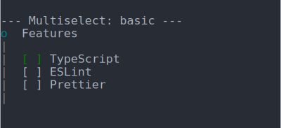</td>
    <td>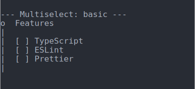</td>
  </tr>
</table>

### Confirm

Yes/No toggle. Arrow keys or `y`/`n` to switch, Enter to confirm.

```php
$install = Prompty::confirm('Install dependencies?',
  description: 'Runs npm install after scaffolding.',
);
```

<table>
  <tr>
    <td></td>
    <td align="center"><strong>ANSI</strong></td>
    <td align="center"><strong>No ANSI</strong></td>
  </tr>
  <tr>
    <td align="right"><strong>Unicode</strong></td>
    <td>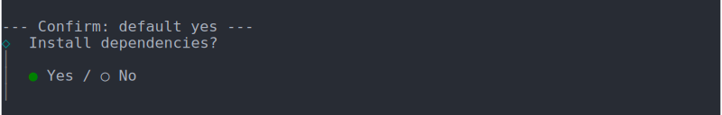</td>
    <td>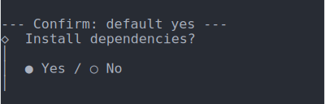</td>
  </tr>
  <tr>
    <td align="right"><strong>ASCII</strong></td>
    <td>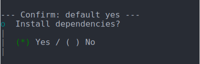</td>
    <td>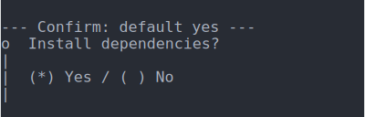</td>
  </tr>
</table>

## Flows

Group widgets into a step-by-step wizard.

```php
$results = Prompty::flow(fn(): array => [
  'name' => Prompty::text('Project name', placeholder: 'my-app'),
  'framework' => Prompty::select('Framework', options: [
    'react' => 'React',
    'vue' => 'Vue',
    'svelte' => 'Svelte',
  ]),
  'features' => Prompty::multiselect('Features', options: [
    'ts' => 'TypeScript',
    'eslint' => 'ESLint',
    'prettier' => 'Prettier',
  ]),
  'install' => Prompty::confirm('Install dependencies?'),
], intro: 'Create a new project', outro: 'Project created!');
```

Flows support intro, outro, and cancellation messages — as strings or callables:

```php
$results = Prompty::flow(fn(): array => [ /* ... */ ],
  intro: 'Welcome',
  outro: function (array $results): void {
    echo 'Created: ' . $results['name'] . "\n";
  },
  cancelled: 'Cancelled.',
  numbering: TRUE, // Renders (1), (2), nested as (1.1), (1.2), etc.
);
```

### Nested flows with conditions

Widgets accept `children` and `condition` to build tree-structured flows.
Children render as an indented tree with bar connectors. Conditions receive
the collected results so far and skip the step when they return `false`.

```php
$results = Prompty::flow(fn(): array => [
  'type' => Prompty::select('Project type',
    options: ['app' => 'Application', 'lib' => 'Library'],
    children: [
      'framework' => Prompty::select('Framework',
        options: ['next' => 'Next.js', 'nuxt' => 'Nuxt'],
        condition: fn($r): bool => ($r['type'] ?? '') === 'app',
      ),
      'format' => Prompty::multiselect('Output formats',
        options: ['esm' => 'ESM', 'cjs' => 'CommonJS'],
        condition: fn($r): bool => ($r['type'] ?? '') === 'lib',
      ),
    ],
  ),
]);
```

## Standalone mode

Widgets work outside of flows too. Call any widget directly and it handles
TTY setup/teardown internally, returning the answer immediately:

```php
require_once 'Prompty.php';

$name = Prompty::text('Project name');
$framework = Prompty::select('Framework', options: ['react' => 'React', 'vue' => 'Vue']);
$install = Prompty::confirm('Install?');

echo "Setting up $name with $framework...\n";
```

You can mix standalone widgets with flows in the same script:

```php
$basics = Prompty::flow(fn(): array => [/* step 1 */], intro: 'Step 1');
$tagline = Prompty::text('Add a tagline?'); // standalone between flows
$options = Prompty::flow(fn(): array => [/* step 2 */], intro: 'Step 2');
```

## Environment variable discovery

Flows auto-discover answers from environment variables. The key name is
uppercased and prefixed with `PROMPTY_` (configurable):

```bash
PROMPTY_NAME=my-app PROMPTY_FRAMEWORK=vue php your-script.php
```

This pre-fills `name` and `framework` without prompting the user. The flow
renders the discovered values as completed steps and moves on.

Configure the prefix per-flow or globally:

```php
$results = Prompty::flow(fn(): array => [/* ... */], env_prefix: 'MYAPP_');
// Reads MYAPP_NAME, MYAPP_FRAMEWORK, etc.
```

For confirm widgets, env values are interpreted using configurable truthy/falsy
lists (default: `1`/`true`/`yes` and `0`/`false`/`no`).

## Descriptions and hints

Every widget accepts a `description` — multi-line text rendered below the label:

```php
Prompty::text('Project name',
  description: "Used as the directory name\nand the package name.",
);
```

Select and multiselect widgets also accept `hints` — per-option text that
updates as the user navigates:

```php
Prompty::select('Framework',
  options: ['react' => 'React', 'vue' => 'Vue', 'svelte' => 'Svelte'],
  hints: [
    'react' => 'Component-based library by Meta.',
    'vue' => "Gentle learning curve.\nSingle-file components.",
    'svelte' => 'Compile-time framework — no virtual DOM.',
  ],
);
```

Hints support multi-line text. They appear below the option list and change
as the user moves between options.

## Unicode and ASCII

Prompty auto-detects Unicode support from the terminal locale (`LANG`,
`LC_ALL`, `LC_CTYPE`). When Unicode is available, it uses symbols like `◆`,
`◇`, `│`, `●`. Otherwise, it falls back to ASCII: `+`, `o`, `|`, `(*)`.

Force a mode:

```php
Prompty::configure(unicode: FALSE); // Always ASCII
Prompty::configure(unicode: TRUE);  // Always Unicode
```

Or per-flow:

```php
$results = Prompty::flow(fn(): array => [/* ... */], unicode: FALSE);
```

## ANSI colors

Prompty auto-detects ANSI color support. It respects the
[`NO_COLOR`](https://no-color.org/) environment variable and `TERM=dumb`.

Force colors on or off:

```php
Prompty::configure(ansi: FALSE); // Suppress all color codes
Prompty::configure(ansi: TRUE);  // Force ANSI colors
```

Or per-flow:

```php
$results = Prompty::flow(fn(): array => [/* ... */], ansi: FALSE);
```

### Display modes

Combine `unicode` and `ansi` to control the output style. Here is how a flat
flow looks in each combination:

<table align="center">
  <tr>
    <td></td>
    <td align="center"><strong>ANSI</strong></td>
    <td align="center"><strong>No ANSI</strong></td>
  </tr>
  <tr>
    <td align="right"><strong>Unicode</strong></td>
    <td></td>
    <td></td>
  </tr>
  <tr>
    <td align="right"><strong>ASCII</strong></td>
    <td></td>
    <td></td>
  </tr>
</table>

And a nested flow:

<table align="center">
  <tr>
    <td></td>
    <td align="center"><strong>ANSI</strong></td>
    <td align="center"><strong>No ANSI</strong></td>
  </tr>
  <tr>
    <td align="right"><strong>Unicode</strong></td>
    <td></td>
    <td></td>
  </tr>
  <tr>
    <td align="right"><strong>ASCII</strong></td>
    <td></td>
    <td></td>
  </tr>
</table>

## Configuration

Configure globally with `Prompty::configure()` or per-flow via named arguments
on `Prompty::flow()`. All parameters are optional — pass only what you want to
override. Per-flow config merges on top of global.

```php
// Global.
Prompty::configure(
  unicode: FALSE,
  env_prefix: 'MYAPP_',
  labels: ['yes' => 'Yep', 'no' => 'Nope'],
);

// Per-flow (merges on top).
$results = Prompty::flow(fn(): array => [/* ... */],
  env_prefix: 'SETUP_',
  truthy: ['1', 'true', 'yes', 'on'],
  falsy: ['0', 'false', 'no', 'off'],
);
```

### Available options

| Parameter         | Type                    | Description                                              |
|-------------------|-------------------------|----------------------------------------------------------|
| `unicode`         | `bool`                  | Force Unicode or ASCII symbols                           |
| `ansi`            | `bool`                  | Force ANSI colors on or suppress all color codes         |
| `env_prefix`      | `string`                | Prefix for env var discovery                             |
| `labels`          | `array<string, string>` | UI labels: `yes`, `no`, `cancelled`, `none`, `separator` |
| `truthy`          | `list<string>`          | Strings treated as `true` for confirm env values         |
| `falsy`           | `list<string>`          | Strings treated as `false` for confirm env values        |
| `symbols_unicode` | `array<string, string>` | Unicode symbol overrides                                 |
| `symbols_ascii`   | `array<string, string>` | ASCII symbol overrides                                   |
| `colors`          | `array<string, string>` | ANSI color escape overrides                              |
| `spacing`         | `array<string, string>` | Indentation strings                                      |

### Reading results

```php
// flow() returns the collected answers.
$results = Prompty::flow(fn(): array => [/* ... */]);

// Or read them later.
$results = Prompty::results();

// Read the full config.
$config = Prompty::config();
```

## Test harness

Prompty ships with `PromptyTestTrait` for PHPUnit. It injects keystrokes into
a memory stream and captures terminal output — no real TTY needed.

```php
use PHPUnit\Framework\TestCase;

require_once 'Prompty.php';
require_once 'PromptyTestTrait.php';

class MyTest extends TestCase {
  use PromptyTestTrait;

  protected function tearDown(): void {
    $this->promptyTearDown();
    parent::tearDown();
  }

  public function testMyFlow(): void {
    $keystrokes = $this->promptyKeys(
      'my-project', self::KEY_ENTER,   // type name + submit
      self::KEY_DOWN, self::KEY_ENTER,  // select second option
      self::KEY_SPACE, self::KEY_ENTER, // toggle first + submit
      self::KEY_ENTER,                  // confirm default
    );

    $this->promptyRunScript(function (): void {
      require 'my-installer.php';
    }, $keystrokes);

    $results = \Prompty::results();
    $this->assertSame('my-project', $results['name']);
    $this->assertSame('vue', $results['framework']);
  }
}
```

### Available key constants

| Constant         | Key          |
|------------------|--------------|
| `KEY_ENTER`      | Enter        |
| `KEY_SPACE`      | Space        |
| `KEY_BACKSPACE`  | Backspace    |
| `KEY_TAB`        | Tab          |
| `KEY_ESCAPE`     | Escape       |
| `KEY_CTRL_C`     | Ctrl+C       |
| `KEY_UP`         | Arrow up     |
| `KEY_DOWN`       | Arrow down   |
| `KEY_LEFT`       | Arrow left   |
| `KEY_RIGHT`      | Arrow right  |

## Starter script

[`starter.php`](starter.php) is a ready-to-use template for your own scripts.
It demonstrates the recommended "kill switch" pattern for testable flows — the
script collects answers, then checks an env var before doing real work:

```php
$results = Prompty::flow(fn(): array => [
  'name' => Prompty::text('Project name', placeholder: 'my-app'),
  // ...
], intro: 'Setup');

if (!getenv('SHOULD_PROCEED')) {
  return; // Tests stop here.
}

// Real work below — only runs in production.
echo 'Creating ' . $results['name'] . "\n";
```

Copy `starter.php`, rename it, and replace the steps with your own.

## Embedding

[`embed.php`](embed.php) minifies `Prompty.php` (strips comments, collapses
blank lines) and embeds it directly into your script — so you can ship a single
file with no `require_once` and no external dependencies.

Download `embed.php` from the
[latest release](https://github.com/AlexSkrypnyk/prompty/releases/latest)
assets alongside `Prompty.php`.

### Setup

Add `// @embed-start` and `// @embed-end` markers in your script around the
`require_once` line:

```php
<?php

declare(strict_types=1);

// phpcs:disable
// @embed-start
require_once __DIR__ . '/Prompty.php';
// @embed-end
// phpcs:enable

use AlexSkrypnyk\Prompty\Prompty;

$name = Prompty::text('Project name');
```

### Usage

Embed in place (modifies the file directly):

```bash
php embed.php my-script.php
```

Embed into a separate output file (source stays unchanged):

```bash
php embed.php my-script.php dist/my-script.php
```

Use `--compact` to collapse the entire class into a single line (plus the
license header comment):

```bash
php embed.php --compact my-script.php
```

Use `--source` to specify an alternative path to the class file to embed
(defaults to `Prompty.php` in the same directory as `embed.php`):

```bash
php embed.php --source /path/to/Prompty.php my-script.php
```

Wrap the markers in `// phpcs:disable` / `// phpcs:enable`
to suppress coding standard warnings on the minified code.

See [`starter.php`](starter.php) for an example with markers already in place.

### Re-embedding

To update an already-embedded script to a newer version of Prompty, replace
`Prompty.php` with the new version and re-run `embed.php`. The embedded region
is replaced with the latest class content while all code outside the markers is
preserved:

```bash
php embed.php my-script.php
```

If the new `Prompty.php` is in a different location, use `--source`:

```bash
php embed.php --source /path/to/new/Prompty.php my-script.php
```

### Kill switch

If your script does not already contain a kill-switch statement, `embed.php`
will automatically inject one after the embed region. This allows tests to run
the script without executing the real work below:

```php
// Kill switch — stop here when running under tests.
// In production, set SHOULD_PROCEED=1 to continue past this point.
if (!getenv('SHOULD_PROCEED')) {
  return;
}
```

Use `--no-killswitch` to skip the injection:

```bash
php embed.php --no-killswitch my-script.php
```

### For AI agents

<details>
<summary>Embed into starter script</summary>

```bash
# Download Prompty.php, embed.php, and the starter template.
curl -LO https://github.com/AlexSkrypnyk/prompty/releases/latest/download/Prompty.php
curl -LO https://github.com/AlexSkrypnyk/prompty/releases/latest/download/embed.php
curl -LO https://github.com/AlexSkrypnyk/prompty/releases/latest/download/starter.php

# Rename the starter to your script name.
mv starter.php my-script.php

# Embed the minified class into the script.
php embed.php my-script.php
```

</details>

<details>
<summary>Embed into custom script</summary>

```bash
# Download Prompty.php and embed.php.
curl -LO https://github.com/AlexSkrypnyk/prompty/releases/latest/download/Prompty.php
curl -LO https://github.com/AlexSkrypnyk/prompty/releases/latest/download/embed.php

# Add markers in your script around the require_once line:
#
#   // phpcs:disable
#   // @embed-start
#   require_once __DIR__ . '/Prompty.php';
#   // @embed-end
#   // phpcs:enable

# Embed the minified class into the script.
php embed.php my-script.php
```

</details>

<details>
<summary>Update Prompty</summary>

```bash
# Download the new Prompty.php, overwriting the old one.
curl -LO https://github.com/AlexSkrypnyk/prompty/releases/latest/download/Prompty.php

# Re-run the embedder. Code outside the markers is preserved.
php embed.php my-script.php

# Or use --source if the new Prompty.php is in a different location.
php embed.php --source /path/to/new/Prompty.php my-script.php
```

</details>

## Maintenance

```bash
composer install
composer lint
composer test
```

---
_This repository was created using the [Scaffold](https://getscaffold.dev/) project template_
