<p align="center">
  <a href="https://github.com/AlexSkrypnyk/prompty" rel="noopener">
  </a>
</p>

<h1 align="center">Zero-dependency interactive CLI prompt library for PHP</h1>

<div align="center">

[](https://github.com/alexskrypnyk/prompty/issues)
[](https://github.com/alexskrypnyk/prompty/pulls)
[](https://github.com/alexskrypnyk/prompty/actions/workflows/test-php.yml)
[](https://codecov.io/gh/alexskrypnyk/prompty)


</div>

---

<p align="center">
  
</p>

## Features

- 📦 [**Zero dependencies**](#installation) — drop `Prompty.php` into your project or [embed](#embedding) into your script
- 🧩 [**Widgets**](#widgets) — `text`, `select`, `multiselect`, `confirm`
- 🔀 [**Flows**](#flows) — group prompts into a wizard with intro/outro, numbering, and cancellation
- 🌳 [**Nested flows**](#nested-flows-with-conditions) — conditional children rendered as a tree
- ⚡ [**Standalone mode**](#standalone-mode) — use any widget on its own, outside of a flow
- 🌍 [**Environment variable discovery**](#environment-variable-discovery) — auto-fill answers from env vars
- 💬 [**Descriptions and hints**](#descriptions-and-hints) — contextual help below labels and per-option
- ✨ [**Unicode and ASCII**](#unicode-and-ascii) — auto-detects terminal support or force a mode
- 🎨 [**ANSI colors**](#ansi-colors) — auto-detects color support, respects `NO_COLOR`
- ⚙️ [**Configuration**](#configuration) — symbols, colors, spacing, labels, env prefix, truthy/falsy values
- 🧪 [**Test harness**](#test-harness) — `PromptyTestTrait` injects keystrokes for PHPUnit testing
- 🚀 [**Starter script**](#starter-script) — [`starter.php`](starter.php) as a template for your own scripts
- 📥 [**Embedding**](#embedding) — minify and embed the class directly into your script

## Installation

Prompty is a single PHP file with zero dependencies. It requires PHP 8.2 or newer.

### Download from releases

Download `Prompty.php` from the [latest release](https://github.com/AlexSkrypnyk/prompty/releases/latest) assets.

Three variants are available:

| Asset                 | Description                                        |
|-----------------------|----------------------------------------------------|
| `Prompty.php`         | Full source with version imprinted                 |
| `Prompty.min.php`     | Minified — comments and blank lines stripped       |
| `Prompty.compact.php` | Compacted — single-line class, shortened internals |

For testing, also download `PromptyTestTrait.php` from the same release.

See [Usage](#usage) for how to embed the class directly into your script.

### Verifying a download

Every release ships a `SHA256SUMS` file covering all assets, signed with the maintainer's GPG key as `SHA256SUMS.asc`. The matching public key is [`PUBLIC_KEY.asc`](PUBLIC_KEY.asc) in this repository, with this fingerprint:

```text
755E 824E 80F8 4913 5F5F  4043 E71E DB25 C4F6 D89D
```

```bash
BASE=https://github.com/AlexSkrypnyk/prompty/releases/latest/download
RAW=https://raw.githubusercontent.com/AlexSkrypnyk/prompty/main

curl -LO $BASE/Prompty.php
curl -LO $BASE/SHA256SUMS
curl -LO $BASE/SHA256SUMS.asc
curl -LO $RAW/PUBLIC_KEY.asc

# Check the fingerprint against the one above before trusting the key.
gpg --show-keys --with-fingerprint PUBLIC_KEY.asc

gpg --import PUBLIC_KEY.asc
gpg --verify SHA256SUMS.asc SHA256SUMS
sha256sum --ignore-missing -c SHA256SUMS
```

`--ignore-missing` lets the checksum check pass when only some assets were downloaded. See [`SECURITY.md`](SECURITY.md) for what this verification does and does not prove.

### Composer

```bash
composer require alexskrypnyk/prompty
```

`PromptyTestTrait` is included in the package.

## Usage

Require the file and use the class directly:

```php
require_once __DIR__ . '/Prompty.php';

use AlexSkrypnyk\Prompty\Prompty;

$dish = Prompty::text('Dish name');
```

Or [embed](#embedding) the minified class directly into your script (using the provided minification script) to ship a single file with no external dependencies.

You may also use the [starter](#starter-script) as a template for your own scripts.

## Widgets

Four widget types cover the most common prompt patterns. Each returns the user's answer, or `null` if they cancel (Escape or Ctrl+C).

Everything a widget draws is rendered as printable text. A newline or tab in a value, a label or an option label becomes a space, and escape sequences and other control characters are removed, so a value carrying them cannot break the tree or drive the terminal. `text` returns the printable form, so a caller gets the same text that was drawn.

<p align="center">
  
</p>

### Text

Free-form text input with an optional editable `default` and placeholder.

```php
$dish = Prompty::text('Dish name',
  default: 'pear tart',
  placeholder: 'e.g. pear tart',
  description: "Written on the order ticket and under\n"
    . '"Specials" on the board.',
);
```

`default` pre-fills the input with an editable value; `placeholder` is the gray hint shown only while the input is empty.

Submitting an empty input returns the `placeholder` string as the answer, so a placeholder doubles as a non-editable fallback value. With a `default` seeded, the buffer is not empty, so submitting without typing returns the default. Leave both unset if an empty answer should stay empty.

An empty answer means the same thing however it arrives. A discovered value is trimmed, and an empty result is read as "nothing typed", so it takes the `default`, or the `placeholder` when no default was seeded:

```php
// All three answer 'pear tart'.
Prompty::text('Dish name', placeholder: 'pear tart');                  // user presses enter
Prompty::text('Dish name', placeholder: 'pear tart', discovered: '');
Prompty::text('Dish name', placeholder: 'pear tart', discovered: '  ');
```

An empty `PROMPTY_DISH=` takes that fallback straight away. An unset `PROMPTY_DISH` prompts instead, and submitting without typing takes the same fallback - so a variable populated by a command that returned nothing lands on the answer a user would have accepted, rather than on an empty string.

<table>
  <tr>
    <td></td>
    <td align="center"><strong>ANSI</strong></td>
    <td align="center"><strong>No ANSI</strong></td>
  </tr>
  <tr>
    <td align="right"><strong>Unicode</strong></td>
    <td>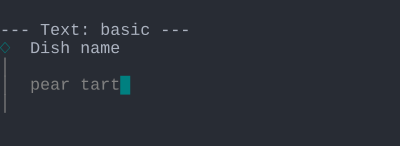</td>
    <td>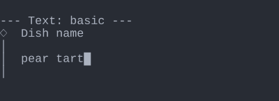</td>
  </tr>
  <tr>
    <td align="right"><strong>ASCII</strong></td>
    <td></td>
    <td></td>
  </tr>
</table>

### Select

Single-choice from a list. Arrow keys to navigate, Enter to confirm. Pass `default` (an option key) to focus an option other than the first.

```php
$course = Prompty::select('Course',
  options: [
    'starter' => 'Starter',
    'main' => 'Main',
    'dessert' => 'Dessert',
  ],
  default: 'main',
  description: 'Where the dish sits in the meal.',
  hints: [
    'starter' => 'Served first, in a small portion.',
    'main' => 'The centre of the meal.',
    'dessert' => 'Sweet, served last.',
  ],
);
```

`options` must not be empty. A widget with nothing to choose from cannot ask a question, so it throws an `InvalidArgumentException` before it draws anything or reads a key - whether the answer would have come from the user, from `discovered`, or from an environment variable:

```text
No options declared for "Course". Provide at least one option.
```

<table>
  <tr>
    <td></td>
    <td align="center"><strong>ANSI</strong></td>
    <td align="center"><strong>No ANSI</strong></td>
  </tr>
  <tr>
    <td align="right"><strong>Unicode</strong></td>
    <td>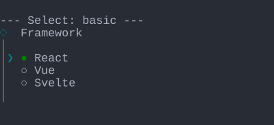</td>
    <td>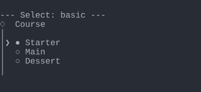</td>
  </tr>
  <tr>
    <td align="right"><strong>ASCII</strong></td>
    <td>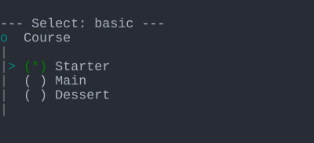</td>
    <td></td>
  </tr>
</table>

### Multiselect

Multiple-choice from a list. Space to toggle, Enter to confirm. Pass `default` (a list of option keys) to pre-check options - ideal for opt-out lists where every option starts selected and the user unchecks what they don't want.

```php
$extras = Prompty::multiselect('Extras',
  options: [
    'bread' => 'Bread',
    'olives' => 'Olives',
    'herbs' => 'Herbs',
  ],
  default: ['bread', 'olives', 'herbs'],
  description: "Anything served alongside.\n"
    . 'Space to toggle, enter to confirm.',
);
```

As with [select](#select), `options` must not be empty - an empty map throws an `InvalidArgumentException` naming the widget, on every path.

<table>
  <tr>
    <td></td>
    <td align="center"><strong>ANSI</strong></td>
    <td align="center"><strong>No ANSI</strong></td>
  </tr>
  <tr>
    <td align="right"><strong>Unicode</strong></td>
    <td>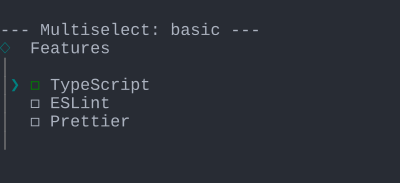</td>
    <td>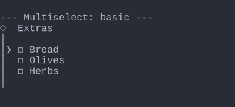</td>
  </tr>
  <tr>
    <td align="right"><strong>ASCII</strong></td>
    <td>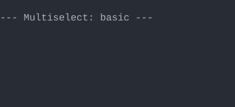</td>
    <td></td>
  </tr>
</table>

### Confirm

Yes/No toggle. Arrow keys or `y`/`n` to switch, Enter to confirm.

```php
$send = Prompty::confirm('Send order?',
  description: 'Passes the order to the kitchen.',
);
```

<table>
  <tr>
    <td></td>
    <td align="center"><strong>ANSI</strong></td>
    <td align="center"><strong>No ANSI</strong></td>
  </tr>
  <tr>
    <td align="right"><strong>Unicode</strong></td>
    <td>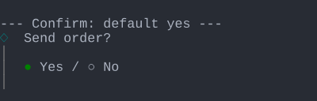</td>
    <td>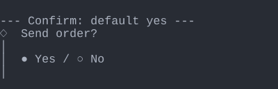</td>
  </tr>
  <tr>
    <td align="right"><strong>ASCII</strong></td>
    <td></td>
    <td>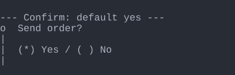</td>
  </tr>
</table>

## Flows

Group widgets into a step-by-step wizard.

```php
$results = Prompty::flow(fn(): array => [
  'dish' => Prompty::text('Dish name', placeholder: 'pear tart'),
  'course' => Prompty::select('Course', options: [
    'starter' => 'Starter',
    'main' => 'Main',
    'dessert' => 'Dessert',
  ]),
  'extras' => Prompty::multiselect('Extras', options: [
    'bread' => 'Bread',
    'olives' => 'Olives',
    'herbs' => 'Herbs',
  ]),
  'send' => Prompty::confirm('Send order?'),
], intro: 'Compose an order', outro: 'Order sent!');
```

`flow()` returns the collected answers keyed by step name, or `null` if the user cancels any step.

An input stream with nothing left to read counts as a cancellation. A script run from a pipe, from `/dev/null`, or from a CI step with no terminal attached stops at the first prompt it cannot read and returns `null`, rather than waiting for input that will never arrive.

Flows support intro, outro, and cancellation messages — as strings or callables:

```php
$results = Prompty::flow(fn(): array => [ /* ... */ ],
  intro: 'Compose an order',
  outro: function (array $results): void {
    echo 'Dish: ' . $results['dish'] . "\n";
  },
  cancelled: 'Order cancelled.',
  numbering: TRUE, // Renders (1), (2), nested as (1.1), (1.2), etc.
);
```

### Nested flows with conditions

Widgets accept `children` and `condition` to build tree-structured flows. Children render as an indented tree with bar connectors. Conditions receive the collected results so far and skip the step when they return `false`.

```php
$results = Prompty::flow(fn(): array => [
  'course' => Prompty::select('Course',
    options: ['main' => 'Main', 'dessert' => 'Dessert'],
    children: [
      'method' => Prompty::select('Method',
        options: [
          'baked' => 'Baked',
          'poached' => 'Poached',
          'grilled' => 'Grilled',
        ],
        condition: fn($r): bool => ($r['course'] ?? '') === 'main',
      ),
      'finishes' => Prompty::multiselect('Finishes',
        options: [
          'glazed' => 'Glazed',
          'dusted' => 'Dusted',
          'piped' => 'Piped',
        ],
        condition: fn($r): bool => ($r['course'] ?? '') === 'dessert',
      ),
    ],
  ),
]);
```

## Standalone mode

Widgets work outside of flows too. Call any widget directly and it handles TTY setup/teardown internally, returning the answer immediately:

```php
require_once 'Prompty.php';

use AlexSkrypnyk\Prompty\Prompty;

$dish = Prompty::text('Dish name');
$course = Prompty::select('Course', options: [
  'starter' => 'Starter',
  'main' => 'Main',
]);
$send = Prompty::confirm('Send order?');

echo "Sending $dish for the $course course...\n";
```

You can mix standalone widgets with flows in the same script:

```php
// Standalone widgets can sit between flows.
$dish = Prompty::flow(fn(): array => [/* step 1 */], intro: 'Step 1: The dish');
$note = Prompty::text('Kitchen note');
$extras = Prompty::flow(fn(): array => [/* step 2 */], intro: 'Step 2: Extras');
```

## Environment variable discovery

Flows auto-discover answers from environment variables. The key name is uppercased and prefixed with `PROMPTY_` (configurable):

```bash
PROMPTY_DISH='pear tart' PROMPTY_COURSE=main php your-script.php
```

This pre-fills `dish` and `course` without prompting the user. The flow renders the discovered values as completed steps and moves on.

Configure the prefix per-flow or globally:

```php
// Reads KITCHEN_DISH, KITCHEN_COURSE, etc.
$results = Prompty::flow(fn(): array => [/* ... */], env_prefix: 'KITCHEN_');
```

Multiselect values are read as a comma-separated list, so `PROMPTY_EXTRAS=bread,olives` selects both options. The result comes back deduplicated and in the order the options were declared, exactly as if the user had ticked them by hand - so `PROMPTY_EXTRAS=olives,bread,olives` also gives you `['bread', 'olives']`. An empty value means nothing is selected, and a stray trailing comma is ignored.

The `discovered:` argument reads a string the same way. That matters because the argument is how a script passes on an answer it already holds - a parsed `--extras=bread,olives` flag, a value read from a config file, an answer carried over from a previous run - and `getopt()` hands a flag over as one string, exactly as `getenv()` does. Either source can therefore stand in for the other:

```php
Prompty::multiselect('Extras', options: $extras, discovered: 'bread,olives');
Prompty::multiselect('Extras', options: $extras, discovered: ['bread', 'olives']);
```

The list form takes each entry literally, which is the way to select an option key that itself contains a comma - a comma-joined string would be split around it.

For confirm widgets, env values are interpreted using configurable truthy/falsy lists (default: `1`/`true`/`yes` and `0`/`false`/`no`).

### Discovered and default values must be valid answers

A discovered value has to be an answer the widget would have accepted interactively. For `select` and `multiselect` that means a key of `options`; for `confirm`, a value in the truthy or falsy list. Anything else throws an `InvalidArgumentException` naming the widget, the offending value, and what was allowed:

```text
Discovered value "pudding" for "Course" is not a valid option. Available options: starter, main, dessert.
```

This applies to both sources - a `discovered:` argument and a `PROMPTY_*` variable - and it holds whether or not a terminal is attached. `text` has no fixed set of answers, so nothing is checked there; its discovered value is trimmed instead, and an empty one falls back to the [default or placeholder](#text).

`default` names an option key too, so `select` and `multiselect` hold it to the same list, with the parameter named in the message:

```text
Default value "pudding" for "Course" is not a valid option. Available options: starter, main, dessert.
```

An empty default means "no default" and is always valid: `''` for `select` focuses the first option, `[]` for `multiselect` pre-checks nothing. Both values are checked before the widget draws, so a mistyped key fails at the widget that declared it rather than opening a prompt that quietly ignores it.

That strictness earns its keep where discovery is actually used. A typo in a CI variable or an installer script fails at the widget that would have consumed it, with a message you can act on, instead of landing in your results and turning into something odd much further downstream.

### A blank value means no answer was supplied

An empty or whitespace-only value - what an exported but never populated shell variable produces, or a `DISH="$(some-command)"` where the command printed nothing - is read as "no answer was supplied". Where a widget has an answer that means exactly that, a blank value takes it; where it has none, a blank value is rejected:

| Widget        | A blank value resolves to                                       |
|---------------|-----------------------------------------------------------------|
| `text`        | The `default`, or the `placeholder` when no default was seeded  |
| `multiselect` | An empty selection, `[]`                                        |
| `select`      | Rejected - one choice has no answer that means "nothing chosen" |
| `confirm`     | Rejected - yes and no are the only answers                      |

A blank value is still a value that was supplied, so it is not the same as leaving the variable unset: an unset `PROMPTY_COURSE` opens the prompt, while `PROMPTY_COURSE=` fails the same check as any other invalid value, with the value reported trimmed:

```text
Discovered value "" for "Course" is not a valid option. Available options: starter, main, dessert.
```

Selecting nothing is a real answer for `multiselect`, so a blank value and a stray trailing comma both give `[]`. The rule holds for both sources - a `discovered:` argument and a `PROMPTY_*` variable.

## Descriptions and hints

Every widget accepts a `description` — multi-line text rendered below the label:

```php
Prompty::text('Dish name',
  description: "Written on the order ticket and under\n"
    . '"Specials" on the board.',
);
```

Select and multiselect widgets also accept `hints` — per-option text that updates as the user navigates:

```php
Prompty::select('Method',
  options: [
    'baked' => 'Baked',
    'poached' => 'Poached',
    'grilled' => 'Grilled',
  ],
  hints: [
    'baked' => 'Dry heat, all the way through.',
    'poached' => "Gently, in barely moving liquid.\n"
      . 'Keeps delicate things whole.',
    'grilled' => 'Over the flame for colour. Fast, hot, and unforgiving.',
  ],
);
```

Hints support multi-line text. They appear below the option list and change as the user moves between options.

## Default values

Every interactive widget can seed its starting state with `default`, so the user begins from a sensible answer and adjusts from there:

| Widget        | `default` type             | Effect                                     |
|---------------|----------------------------|--------------------------------------------|
| `text`        | `string`                   | Pre-fills the editable input buffer.       |
| `select`      | `string` (option key)      | Focuses that option instead of the first.  |
| `multiselect` | `list<int\|string>` (keys) | Pre-checks those options.                  |
| `confirm`     | `bool`                     | Starts on Yes (`true`) or No (`false`).    |

```php
// Opt-out list: everything starts checked; the user unchecks what to drop.
$extras = Prompty::multiselect('Extras', options: [
  'bread' => 'Bread',
  'olives' => 'Olives',
  'herbs' => 'Herbs',
], default: ['bread', 'olives', 'herbs']);
```

`default` only seeds the *interactive* starting state. A value supplied via `discovered` or a `PROMPTY_*` environment variable still takes precedence and skips the prompt entirely, so explicit input always wins over the default.

For `select` and `multiselect`, every key in `default` has to be a key of `options` - see [Discovered and default values must be valid answers](#discovered-and-default-values-must-be-valid-answers).

## Unicode and ASCII

Prompty auto-detects Unicode support from the terminal locale (`LANG`, `LC_ALL`, `LC_CTYPE`). When Unicode is available, it uses symbols like `◆`, `◇`, `│`, `●`. Otherwise, it falls back to ASCII: `+`, `o`, `|`, `(*)`.

Force a mode:

```php
Prompty::configure(unicode: FALSE); // Always ASCII
Prompty::configure(unicode: TRUE);  // Always Unicode
```

Or per-flow:

```php
$results = Prompty::flow(fn(): array => [/* ... */], unicode: FALSE);
```

## ANSI colors

Prompty auto-detects ANSI color support. It respects the [`NO_COLOR`](https://no-color.org/) environment variable and `TERM=dumb`.

Force colors on or off:

```php
Prompty::configure(ansi: FALSE); // Suppress all color codes
Prompty::configure(ansi: TRUE);  // Force ANSI colors
```

Or per-flow:

```php
$results = Prompty::flow(fn(): array => [/* ... */], ansi: FALSE);
```

### Display modes

Combine `unicode` and `ansi` to control the output style. Here is how a flat flow looks in each combination:

<table align="center">
  <tr>
    <td></td>
    <td align="center"><strong>ANSI</strong></td>
    <td align="center"><strong>No ANSI</strong></td>
  </tr>
  <tr>
    <td align="right"><strong>Unicode</strong></td>
    <td></td>
    <td></td>
  </tr>
  <tr>
    <td align="right"><strong>ASCII</strong></td>
    <td></td>
    <td></td>
  </tr>
</table>

And a nested flow:

<table align="center">
  <tr>
    <td></td>
    <td align="center"><strong>ANSI</strong></td>
    <td align="center"><strong>No ANSI</strong></td>
  </tr>
  <tr>
    <td align="right"><strong>Unicode</strong></td>
    <td></td>
    <td></td>
  </tr>
  <tr>
    <td align="right"><strong>ASCII</strong></td>
    <td></td>
    <td></td>
  </tr>
</table>

## Configuration

Configure globally with `Prompty::configure()` or per-flow via named arguments on `Prompty::flow()`. All parameters are optional — pass only what you want to override. Per-flow config merges on top of global.

A per-flow argument lasts as long as the flow. Whether the flow completes, is cancelled, or throws, the configuration it found is back in force when it returns, so the next flow sees the global settings rather than the last flow's. `Prompty::configure()` is the way to change something for the rest of the process.

```php
// Global.
Prompty::configure(
  unicode: FALSE,
  env_prefix: 'KITCHEN_',
  labels: ['yes' => 'Yep', 'no' => 'Nope'],
);

// Per-flow (merges on top).
$results = Prompty::flow(fn(): array => [/* ... */],
  env_prefix: 'ORDER_',
  truthy: ['1', 'true', 'yes', 'on'],
  falsy: ['0', 'false', 'no', 'off'],
);
```

### Available options

| Parameter         | Type                    | Description                                              |
|-------------------|-------------------------|----------------------------------------------------------|
| `unicode`         | `bool`                  | Force Unicode or ASCII symbols                           |
| `ansi`            | `bool`                  | Force ANSI colors on or suppress all color codes         |
| `env_prefix`      | `string`                | Prefix for env var discovery                             |
| `labels`          | `array<string, string>` | UI labels: `yes`, `no`, `cancelled`, `none`, `separator` |
| `truthy`          | `list<string>`          | Strings treated as `true` for confirm env values         |
| `falsy`           | `list<string>`          | Strings treated as `false` for confirm env values        |
| `symbols_unicode` | `array<string, string>` | Unicode symbol overrides                                 |
| `symbols_ascii`   | `array<string, string>` | ASCII symbol overrides                                   |
| `colors`          | `array<string, string>` | ANSI color escape overrides                              |
| `spacing`         | `array<string, string>` | Indentation strings                                      |

### Unknown keys are rejected

`labels`, `spacing`, `colors`, `symbols_unicode` and `symbols_ascii` each accept a fixed set of keys - whichever ones the defaults declare, which `Prompty::config()` prints. A key outside that set is rejected rather than merged in, so a misspelling fails at the call instead of quietly doing nothing, and the message lists the keys that would have worked:

```text
Configuration key "bogus" for "labels" is not valid. Available keys: yes, no, cancelled, none, separator.
```

`truthy` and `falsy` must each list at least one value, since a `confirm` widget that cannot resolve half its domain would reject every value it was given.

An empty `env_prefix` is accepted, and makes discovery read the bare uppercased step key. A step named `path`, `home` or `user` then reads `PATH`, `HOME` or `USER` from the ambient environment, so keep a prefix unless you mean exactly that.

### Other methods

Besides the four widgets and `flow()`, the class exposes:

| Method                    | Returns  | Description                                                     |
|---------------------------|----------|-----------------------------------------------------------------|
| `Prompty::results()`      | `array`  | The answers collected by the last flow.                         |
| `Prompty::config()`       | `array`  | The resolved configuration, including auto-detected values.     |
| `Prompty::version()`      | `string` | The release version, or `development` when running from source. |
| `Prompty::intro($text)`   | `void`   | Prints an intro banner outside of `flow()`.                     |
| `Prompty::outro($text)`   | `void`   | Prints an outro banner outside of `flow()`.                     |
| `Prompty::output($lines)` | `int`    | Prints an array of lines in Prompty's style; returns the count. |

```php
// flow() returns the collected answers.
$results = Prompty::flow(fn(): array => [/* ... */]);

// Or read them later.
$results = Prompty::results();

// Print a banner yourself. Passing a callable as flow()'s outro suppresses
// the built-in one, so call this from inside it to keep the banner.
Prompty::outro('Order sent to the kitchen!');
```

## Test harness

Prompty ships with `PromptyTestTrait` for PHPUnit. It injects keystrokes into a memory stream and captures terminal output — no real TTY needed.

Use `promptyRun()` when the flow's return value is what you want to assert on:

```php
use AlexSkrypnyk\Prompty\Prompty;
use AlexSkrypnyk\Prompty\PromptyTestTrait;
use PHPUnit\Framework\TestCase;

require_once 'Prompty.php';
require_once 'PromptyTestTrait.php';

class MyFlowTest extends TestCase {
  use PromptyTestTrait;

  protected function tearDown(): void {
    $this->promptyTearDown();
    parent::tearDown();
  }

  public function testMyFlow(): void {
    $keystrokes = $this->promptyKeys(
      'plum compote', self::KEY_ENTER,  // type dish + submit
      self::KEY_DOWN, self::KEY_ENTER,  // select second option
    );

    $run = $this->promptyRun(fn(): mixed => Prompty::flow(fn(): array => [
      'dish' => Prompty::text('Dish name'),
      'course' => Prompty::select('Course', options: [
        'starter' => 'Starter',
        'main' => 'Main',
      ]),
    ]), $keystrokes);

    $this->assertSame('plum compote', $run['result']['dish']);
    $this->assertSame('main', $run['result']['course']);
    $this->assertStringContainsString('Dish name', $run['output']);
  }
}
```

Use `promptyRunScript()` to drive a consumer script instead. Leave the script's [kill switch](#starter-script) variable unset so it stops before doing real work, then read the answers from `Prompty::results()`:

```php
public function testMyScript(): void {
  $keystrokes = $this->promptyKeys(
    'plum compote', self::KEY_ENTER,
    self::KEY_DOWN, self::KEY_ENTER,
  );

  $this->promptyRunScript(function (): void {
    require 'my-script.php';
  }, $keystrokes);

  $results = Prompty::results();
  $this->assertSame('plum compote', $results['dish']);
  $this->assertSame('main', $results['course']);
}
```

Both helpers return an array with an ANSI-stripped `output` key; `promptyRun()` adds a `result` key holding the callback's return value.

A widget that reads past the last queued keystroke reaches the end of the stream and cancels, so a test with too few keystrokes gets a `null` result its assertions can catch, rather than blocking on the terminal.

### Available key constants

| Constant         | Key          |
|------------------|--------------|
| `KEY_ENTER`      | Enter        |
| `KEY_SPACE`      | Space        |
| `KEY_BACKSPACE`  | Backspace    |
| `KEY_TAB`        | Tab          |
| `KEY_ESCAPE`     | Escape       |
| `KEY_CTRL_C`     | Ctrl+C       |
| `KEY_UP`         | Arrow up     |
| `KEY_DOWN`       | Arrow down   |
| `KEY_LEFT`       | Arrow left   |
| `KEY_RIGHT`      | Arrow right  |

## Starter script

[`starter.php`](starter.php) is a ready-to-use template for your own scripts. It demonstrates the recommended "kill switch" pattern for testable flows — the script collects answers, then checks an env var before doing real work:

```php
$results = Prompty::flow(fn(): array => [
  'dish' => Prompty::text('Dish name', placeholder: 'pear tart'),
  // ...
], intro: 'Compose an order');

if (!getenv('SHOULD_PROCEED')) {
  return; // Tests stop here.
}

// Real work below - only runs in production.
echo 'Dish: ' . $results['dish'] . "\n";
```

Copy `starter.php`, rename it, and replace the steps with your own.

## Embedding

[`embed.php`](embed.php) minifies `Prompty.php` (strips comments, collapses blank lines) and embeds it directly into your script — so you can ship a single file with no `require_once` and no external dependencies.

Download `embed.php` from the [latest release](https://github.com/AlexSkrypnyk/prompty/releases/latest) assets alongside `Prompty.php`.

### Setup

Add `// @embed-start` and `// @embed-end` markers in your script around the `require_once` line **and the import**:

```php
<?php

declare(strict_types=1);

// phpcs:disable
// @embed-start
require_once __DIR__ . '/Prompty.php';
use AlexSkrypnyk\Prompty\Prompty;
// @embed-end
// phpcs:enable

$dish = Prompty::text('Dish name');
```

Both lines go inside the markers. The embedded class is emitted without a namespace, so an import left outside them collides with it and the embedded script fails to parse.

### Usage

Embed in place (modifies the file directly):

```bash
php embed.php my-script.php
```

Embed into a separate output file (source stays unchanged):

```bash
php embed.php my-script.php dist/my-script.php
```

Wrap the markers in `// phpcs:disable` / `// phpcs:enable` to suppress coding standard warnings on the minified code.

See [`starter.php`](starter.php) for an example with markers already in place. For a worked before-and-after, [`playground/flow-embed.php`](playground/flow-embed.php) is the demo the embedder is tested against. Build its embedded copy with `php embed.php playground/flow-embed.php playground/flow-embed.dist.php`, then run both and diff them to see exactly what changed - the copy is generated on demand rather than kept in the repository.

### Options

| Option            | Description                                                                              |
|-------------------|------------------------------------------------------------------------------------------|
| `--source <path>` | Path to the class file to embed. Defaults to `Prompty.php` beside `embed.php`.            |
| `--compact`       | Collapse the class onto a single line and shorten internal names, for a smaller output.   |
| `--stdout`        | Write the processed class as a standalone PHP file instead of embedding into a script.    |
| `--no-killswitch` | Skip injecting the kill switch block and the post-embed verification run.                 |
| `--no-verify`     | Skip the post-embed verification run, still injecting the kill switch block.              |

```bash
php embed.php --compact my-script.php
php embed.php --source /path/to/Prompty.php my-script.php
php embed.php --stdout Prompty.min.php
```

`--stdout` takes an output path rather than a target script, and is how the release workflow builds the `Prompty.min.php` and `Prompty.compact.php` assets.

### Re-embedding

To update an already-embedded script to a newer version of Prompty, replace `Prompty.php` with the new version and re-run `embed.php`. The embedded region is replaced with the latest class content while all code outside the markers is preserved:

```bash
php embed.php my-script.php
```

If the new `Prompty.php` is in a different location, use `--source`:

```bash
php embed.php --source /path/to/new/Prompty.php my-script.php
```

### Kill switch

If your script does not already contain a kill-switch statement, `embed.php` will automatically inject one after the embed region. This allows tests to run the script without executing the real work below:

```php
// Kill switch - stop here when running under tests.
// In production, set SHOULD_PROCEED=1 to continue past this point.
if (!getenv('SHOULD_PROCEED')) {
  return;
}
```

Use `--no-killswitch` to skip the injection:

```bash
php embed.php --no-killswitch my-script.php
```

### Verification run

Once the file is written, `embed.php` runs it to confirm the embedded class works. In a terminal the run takes over the keyboard so the flow can be stepped through by hand; otherwise it pipes a few newlines in and discards the output.

The kill switch is what keeps that run from reaching the real work, so the run only happens when the file ends up with one. `--no-killswitch` therefore skips the run as well as the injection.

Use `--no-verify` to embed without running the result while still injecting the kill switch - for build steps, CI jobs, and scripts that regenerate an embedded file:

```bash
php embed.php --no-verify my-script.php
```

### For AI agents

<details>
<summary>Embed into starter script</summary>

```bash
BASE=https://github.com/AlexSkrypnyk/prompty/releases/latest/download

# Download Prompty.php, embed.php, and the starter template.
curl -LO $BASE/Prompty.php
curl -LO $BASE/embed.php
curl -LO $BASE/starter.php

# Rename the starter to your script name.
mv starter.php my-script.php

# Embed the minified class into the script.
php embed.php my-script.php
```

</details>

<details>
<summary>Embed into custom script</summary>

```bash
BASE=https://github.com/AlexSkrypnyk/prompty/releases/latest/download

# Download Prompty.php and embed.php.
curl -LO $BASE/Prompty.php
curl -LO $BASE/embed.php

# Add markers in your script around the require_once line and the import.
# Both must sit inside the markers - the embedded class has no namespace,
# so an import left outside them collides with it:
#
#   // phpcs:disable
#   // @embed-start
#   require_once __DIR__ . '/Prompty.php';
#   use AlexSkrypnyk\Prompty\Prompty;
#   // @embed-end
#   // phpcs:enable

# Embed the minified class into the script.
php embed.php my-script.php
```

</details>

<details>
<summary>Update Prompty</summary>

```bash
BASE=https://github.com/AlexSkrypnyk/prompty/releases/latest/download

# Download the new Prompty.php, overwriting the old one.
curl -LO $BASE/Prompty.php

# Re-run the embedder. Code outside the markers is preserved.
php embed.php my-script.php

# Or use --source if the new Prompty.php is in a different location.
php embed.php --source /path/to/new/Prompty.php my-script.php
```

</details>

## Contributing

See [`CONTRIBUTING.md`](CONTRIBUTING.md) for local development setup, the linting and testing commands, the playground scripts, and the release process.

## Security

See [`SECURITY.md`](SECURITY.md) for how to report a vulnerability and how to verify a downloaded release.

---
_This repository was created using the [Scaffold](https://getscaffold.dev/) project template_
